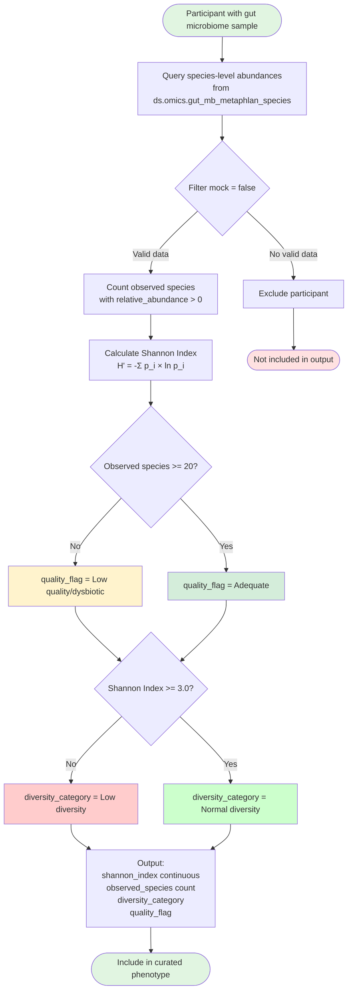

# Gut Microbiome Diversity — Logic Diagram

## Decision Logic Summary

1. **Data Acquisition**: Extract species-level MetaPhlAn abundances for each participant
2. **Quality Control**: Exclude mock community samples (mock = true)
3. **Feature Computation**:
   - **Observed species richness**: Count distinct species with relative_abundance > 0
   - **Shannon index**: Apply Shannon-Wiener formula across all detected species
4. **Quality Assessment**: Flag samples with <20 species as potentially low-quality or dysbiotic
5. **Diversity Classification**: Apply threshold of 3.0 to categorize as "Low diversity" or "Normal diversity"
6. **Output**: Generate participant-level record with all four features
