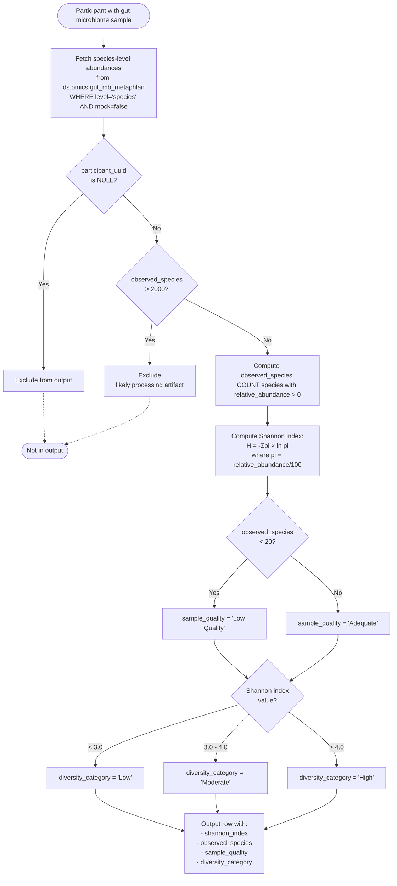

# Gut Microbiome Diversity — Logic Diagram

## Key Decision Points

1. **Data Quality Filters:**
   - Exclude mock community samples (mock=true)
   - Exclude NULL participant UUIDs
   - Exclude extreme outliers (>2000 species)

2. **Sample Quality Classification:**
   - Low Quality: <20 observed species (likely low biomass or technical failure)
   - Adequate: ≥20 observed species

3. **Diversity Categories:**
   - Low: Shannon index <3.0
   - Moderate: Shannon index 3.0-4.0
   - High: Shannon index >4.0

## Output Schema

| Column | Type | Description |
|--------|------|-------------|
| `participant_uuid` | string | Unique participant identifier |
| `gut_microbiome_diversity__shannon_index` | double | Shannon diversity index (continuous, typically 0-6) |
| `gut_microbiome_diversity__observed_species` | int | Count of species with relative abundance >0 |
| `gut_microbiome_diversity__sample_quality` | string | 'Adequate' or 'Low Quality' |
| `gut_microbiome_diversity__diversity_category` | string | 'High', 'Moderate', or 'Low' |
